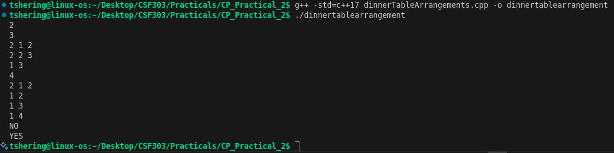
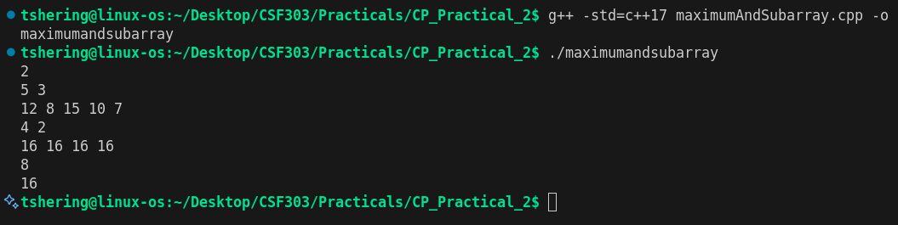
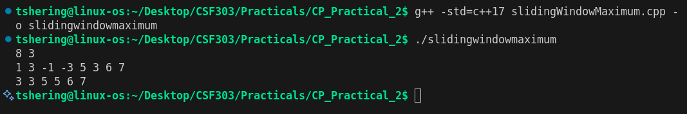
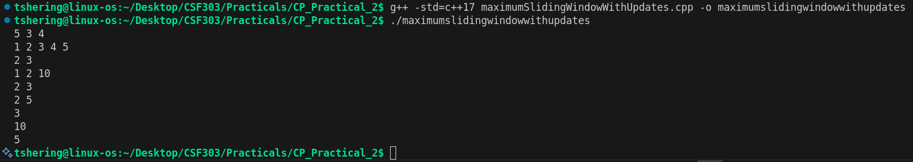
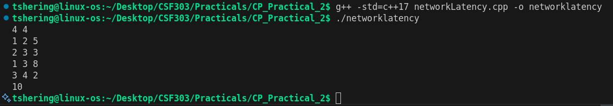
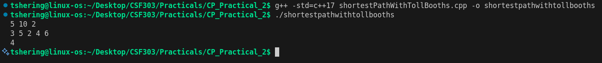

# CSF303 Practical_2

## Problem 1: Dinner Table Arrangements
### Summary
Arrange N friends around a round table so that no two adjacent people share an allergy. Each friend's allergies are given as IDs; treat them as a bitmask.

### Algorithm
Build adjacency by testing mask intersection (disjoint => adjacent allowed). Fix one person as start and run bitmask DP over subsets to check for a Hamiltonian cycle that returns to start.

### Complexity
- Time: O(N * 2^N * N) in worst form, with N ≤ 20 this is feasible.
- Space: O(N * 2^N).

### Reflection
Bitmask DP is a natural fit when N is small; fixing a start node removes rotational symmetry. Watch out for 1-based vs 0-based indices in input parsing.

### Screenshot

## Problem 2: Maximum AND Subarray
### Summary
Given array A and window length K, find the maximum value obtainable by bitwise AND of all elements in any contiguous subarray of length exactly K.

### Algorithm
Greedy bit construction: try to set the current bit in the answer, and test whether any K-length segment has all bits of the candidate set (check via (A[i] & candidate) == candidate). Keep bits that pass.

### Complexity
- Time: O(32 * N) per test case (checking 32 bits). For constraints N ≤ 1e5 this is linear per bit sweep.
- Space: O(N).

### Reflection
Greedy per-bit is simple and fast; ensure to use 32 or 31 bits depending on input bound (here 0..1e9 fits 30 bits but we use 31/32 safely).

### Screenshot

## Problem 3: Sliding Window Maximum
### Summary
Compute maximum of every contiguous subarray (window) of size K over an array of length N.

### Algorithm
Maintain a deque of indices with values in decreasing order. Remove indices out of window and pop smaller elements from back; front holds current window max.

### Complexity
- Time: O(N).
- Space: O(K) for the deque.

### Reflection
Standard sliding-window technique. Use indices (not values) to manage windows cleanly.

### Screenshot

## Problem 4: Maximum in Sliding Window with Updates
### Summary
Maintain an array with point updates and answer queries asking for the maximum inside a window of fixed size K that ends at index i.

### Algorithm
Use a segment tree (or any RMQ structure with updates) to answer range maximum queries in O(log N) and perform point updates in O(log N). For a type-2 query with end i, query range [i-K+1, i] (clamped) and return max.

### Complexity
- Time: O((Q + N) log N) for building and processing Q queries.
- Space: O(N) for the segment tree.

### Reflection
Carefully clamp the query range when the window extends before the start. Clarify whether indices are 1-based in input and adjust accordingly.

### Screenshot

## Problem 5: Network Latency
### Summary
Compute propagation/latency times in a network (shortest-path style problem) given weighted edges and starting node(s).

### Algorithm
Use Dijkstra's algorithm (or multi-source Dijkstra) to compute shortest travel/latency times from the source to all nodes, then extract maximum/required value per problem statement.

### Complexity
- Time: O((N + E) log N) with a priority queue.
- Space: O(N + E).

### Reflection
Check graph indexing and unreachable nodes handling; return sentinel or -1 for unreachable cases per problem spec.

### Screenshot

## Problem 6: The Shortest Path with Toll Booths
### Summary
You travel along N booths. At each booth you may pay the toll to move (cost 1 minute) or skip that booth (cost 2 minutes) but you may skip at most K booths. You also have M coins and cannot pay if you lack coins — compute minimum time to reach booth N or -1.

### Algorithm
DP over positions and skips used: dp[i][s] = minimum time to reach booth i having used s skips. Transition by paying (if coins available) or skipping (if skips remain). Track remaining coins when simulating pay actions or incorporate coins into state if needed.

### Complexity
- Time: O(N * K).
- Space: O(N * K).

### Reflection
The provided implementation needs to track coin usage: paying requires verifying M (or remaining coins) before allowing the pay transition. If coins are limited, include coins or used-pay-count in state or pre-check feasibility. Ensure indexing and boundary transitions (i → i+1) are correct.

### Screenshot

