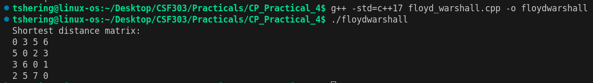
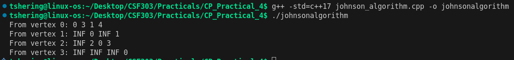
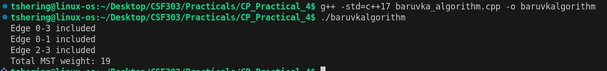

# CP Practical 4 — Graph Algorithms

This folder contains three graph algorithms implemented for the practical: Floyd–Warshall, Johnson's algorithm and Boruvka's algorithm.

## Algorithms

### 1) Floyd–Warshall
- Purpose: compute shortest paths between all pairs of vertices (APSP).
- Approach: dynamic programming over intermediate vertices; dist[i][j] = min(dist[i][j], dist[i][k] + dist[k][j]).
- When to use: dense graphs or when you need APSP; not ideal for large V due to cubic time.
- Time: O(V^3)
- Space: O(V^2)

### 2) Johnson's Algorithm
- Purpose: APSP for sparse graphs with possible negative edge weights (no negative cycles).
- Approach: run Bellman–Ford once to reweight edges and then run Dijkstra from each vertex.
- When to use: sparse graphs where Floyd–Warshall would be too slow and edges may be negative.
- Time: O(V E log V) (with priority queue), plus Bellman–Ford O(VE).
- Space: O(V + E)

### 3) Borůvka's Algorithm
- Purpose: compute the Minimum Spanning Tree (MST).
- Approach: repeatedly for each component pick the cheapest outgoing edge and merge components until only one remains.
- When to use: good for parallel MST construction and works well on large graphs; complementary to Kruskal/Prim.
- Time: O(E log V) (implementation dependent)
- Space: O(V + E)

