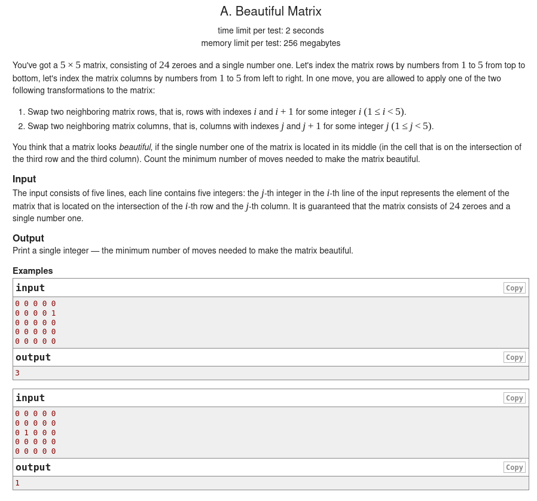
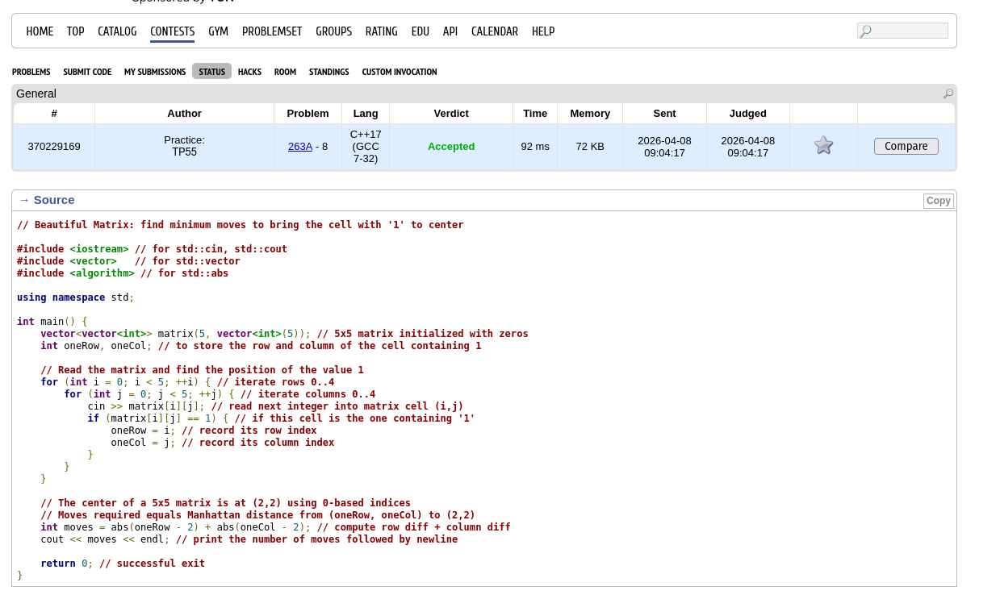
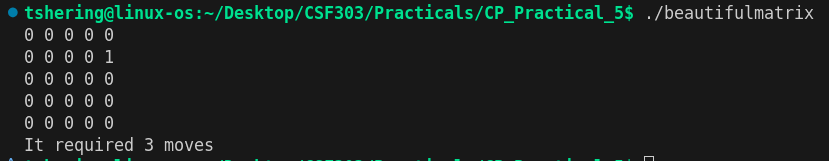
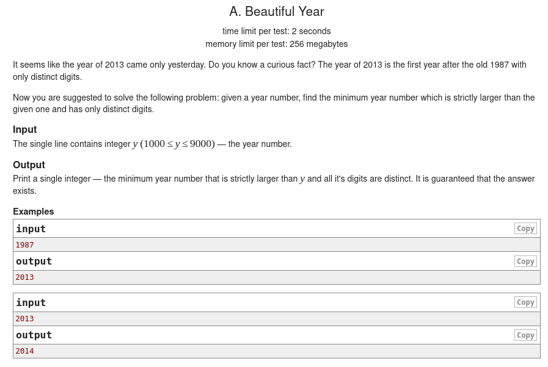
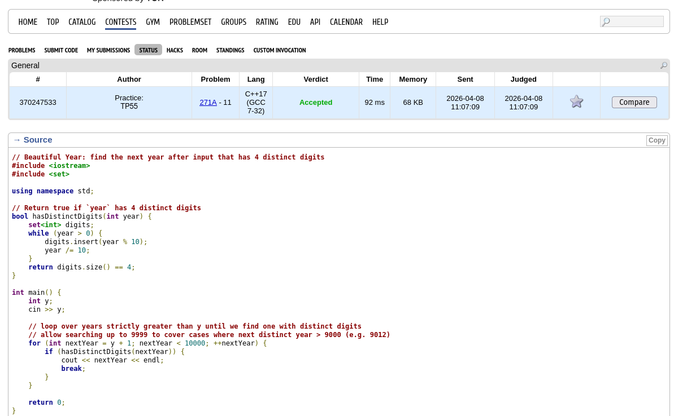
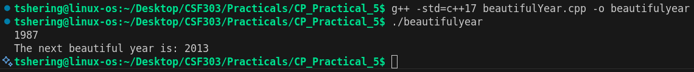

# CP Practical 5 — Code Race
In the code race, i have solved the following two problem.

## Files
- `beautifulMatrix.cpp` — computes the minimum number of moves to bring the single `1` in a 5×5 matrix to the center.
- `beautifulYear.cpp` — finds the next year after a given year where all digits are distinct.

## 1) beautifulMatrix

### Problem statement

Given a 5×5 matrix containing exactly one `1` and the rest `0`s, we have determine the minimum number of moves required to bring the `1` to the center cell (row 3, column 3). A move swaps the `1` with an adjacent cell (up, down, left or right).

### Approach
- Read the 5×5 grid and locate the coordinates (r, c) of the element `1`.
- The answer is the distance to the center: `abs(r - 3) + abs(c - 3)`.

### Time & Space complexity
- Time: O(1): the algorithm scans a fixed 25 elements.
- Space: O(1): constant extra memory.

### Edge cases
- The input must contain exactly one `1` (problem constraint).
- Input is five lines of five integers each.

### Screenshots
- Code status:
	
- Program output:
	

## 2) beautifulYear

### Problem statement

Given a year `y`, find the smallest year strictly greater than `y` such that all digits of the year are distinct.

### Approach
- Start with `year = y + 1` and iterate upward.
- For each candidate year, check whether its digits are all unique (e.g., convert to string and use a set).
- When a candidate with distinct digits is found, print it and stop.

### Time & Space complexity
- Time: O(k) where k is the number of years checked; for 4-digit years this is bounded and effectively constant in practice.
- Space: O(1) — small fixed memory for digit uniqueness check.

### Edge cases
- Years are treated as integers; leading zeros are not used (years >= 1000 in typical problem statements).

### Screenshot placeholders
- Code status:
	
- Program output:
	

