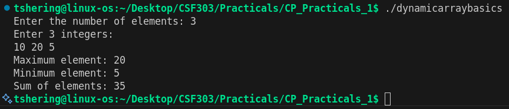
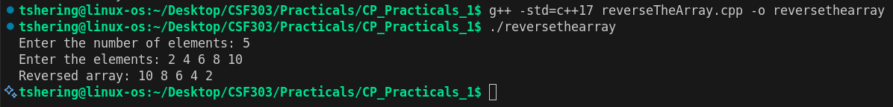
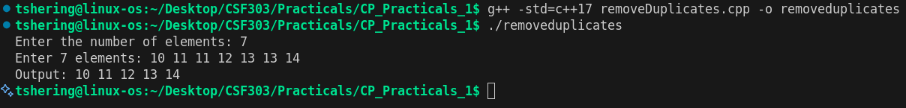
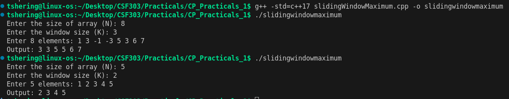
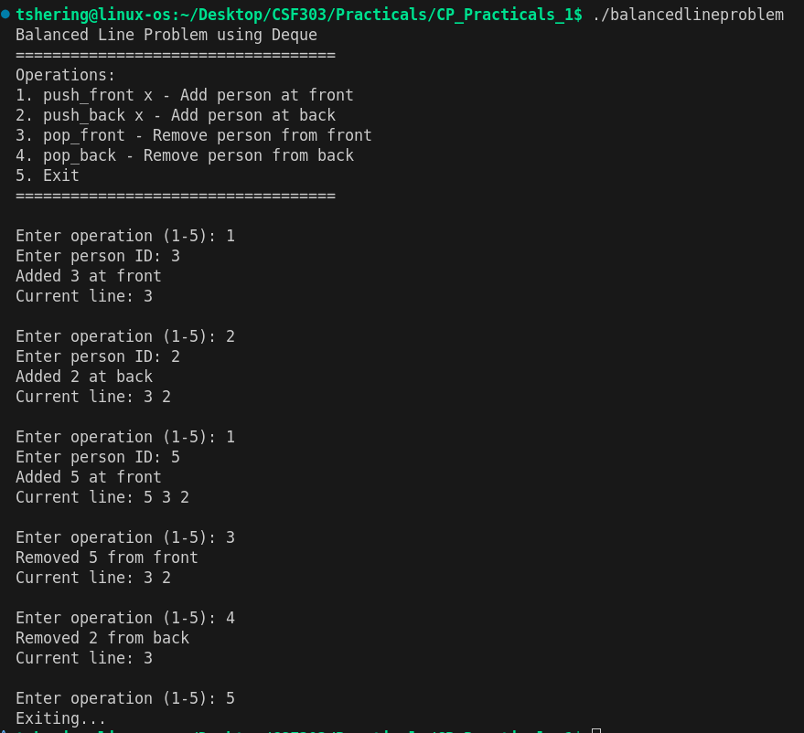
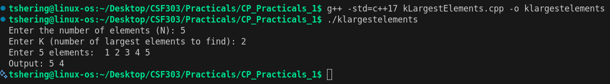
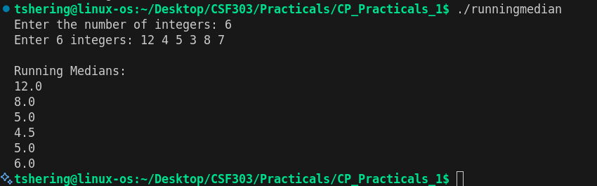
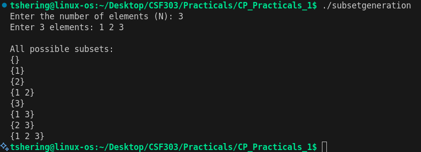
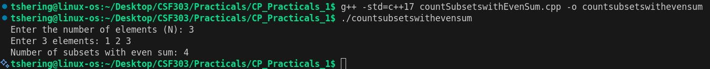
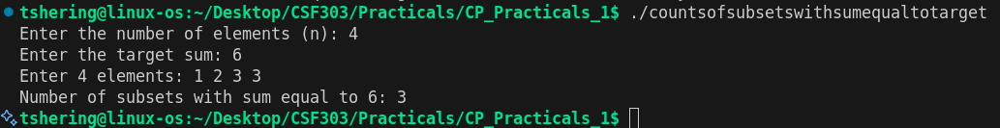

# CSF303 Practicals - Dynamic Arrays & Data Structures

## Problem 1: Dynamic Array Basics

### a. Problem Summary
Read N integers into a dynamic container (vector) and compute three key statistics: the maximum element, minimum element, and sum of all elements. This is a foundational problem for understanding dynamic arrays and basic aggregation operations.

### b. Algorithm Explanation
1. Read integer N (number of elements)
2. Create a vector of size N
3. Read N integers into the vector
4. Initialize max and min with the first element
5. Iterate through the vector once:
   - Update max if current element is greater
   - Update min if current element is smaller
   - Add current element to running sum
6. Print max, min, and sum

**Key insight**: Single-pass algorithm processes each element exactly once for all three statistics.

### c. Time Complexity Analysis
- **Reading input**: O(n)
- **Finding max, min, sum**: O(n) single pass
- **Overall**: O(n)

### d. Space Complexity Analysis
- **Vector storage**: O(n) for storing n integers
- **Additional space**: O(1) for variables (max, min, sum)
- **Overall**: O(n)

### e. Reflection
This was my first exposure to dynamic arrays and the efficiency of the vector container in C++. I learned that vectors automatically handle memory allocation, making the code safer and more concise than manual pointer-based arrays. The single-pass approach for computing three statistics simultaneously taught me the importance of minimizing iterations. This problem reinforced that for independent aggregation operations (max, min, sum), we can compute all of them in one traversal rather than multiple passes, saving both time and code complexity.

### f. Screenshot

---

## Problem 2: Reverse the Array

### a. Problem Summary
Given N integers stored in a vector, print all elements in reverse order (from last to first). This demonstrates backward traversal of arrays, a fundamental operation in many algorithms like palindrome checking, array manipulation, and undo operations.

### b. Algorithm Explanation
1. Read integer N (number of elements)
2. Create a vector of size N
3. Read N integers into the vector
4. Traverse the vector backwards:
   - Start from index n-1 (last element)
   - Decrement index i by 1 in each iteration
   - Continue until i < 0
   - Print each element with space separation
5. Output the reversed sequence

**Why backward traversal?** Using a reverse loop is simpler and more efficient than copying to another array or using built-in reverse functions (though `std::reverse` is also an option).

### c. Time Complexity Analysis
- **Reading input**: O(n)
- **Reverse traversal and printing**: O(n) backward loop
- **Overall**: O(n)

### d. Space Complexity Analysis
- **Vector storage**: O(n) for storing n integers
- **Additional space**: O(1) only for loop variables
- **Overall**: O(n)

### e. Reflection
This simple problem taught me the elegance of different traversal patterns. While I could use `std::reverse()` from the algorithm library, manually iterating backward provides better understanding of loop control and indexing. I realized that sometimes the simplest solution is not always the most educational. This problem also made me appreciate that C++ provides both low-level control (manual loops) and high-level abstractions (STL algorithms). Understanding when to use each is key to writing both efficient and maintainable code.

### f. Screenshot

---

## Problem 3: Remove Duplicates

### a. Problem Summary
Given N integers, remove duplicate values and print only unique elements in sorted order. The task involves storing numbers in a vector, sorting them, and then filtering out duplicate consecutive elements to display each unique value only once.

### b. Algorithm Explanation
1. Store all N elements in a vector
2. Sort the vector using `sort()` function
3. Iterate through the sorted vector:
   - Print the first element (always unique)
   - For subsequent elements, print only if different from the previous element
4. After sorting, duplicate elements are adjacent, making it easy to skip them

### c. Time Complexity Analysis
- **Sorting**: O(n log n) using `std::sort` (introsort algorithm)
- **Filtering**: O(n) single pass to print unique elements
- **Overall**: O(n log n)

### d. Space Complexity Analysis
- **Vector storage**: O(n) for storing input elements
- **Additional space**: O(1) excluding the input vector
- **Overall**: O(n)

### e. Reflection
This problem taught me the importance of sorting as a preprocessing step. Initially, I thought about using a set to remove duplicates, but realized that sorting first and then iterating makes the solution more straightforward and avoids the overhead of hash-based data structures. The key insight is recognizing that after sorting, duplicates are naturally adjacent, allowing for a simple linear pass to identify unique elements.

### f. Screenshot

---

## Problem 4: Sliding Window Maximum

### a. Problem Summary
Given an array of size N and a window size K, find the maximum element in every sliding window of size K. The window moves from left to right, and for each position, we need to output the maximum element within that window.

### b. Algorithm Explanation
1. Use a deque to store indices of useful elements (in decreasing order of values)
2. Process the first K elements:
   - Remove elements from the back if current element is greater
   - Add current element index to the back
3. Print the maximum of the first window (front of deque)
4. For remaining elements:
   - Remove indices outside the current window from front
   - Remove elements from back smaller than current element
   - Add current index to back
   - Print front (maximum of current window)

**Why deque?** It efficiently maintains candidates for maximum by storing indices in decreasing order, eliminating the need to check all elements in the window.

### c. Time Complexity Analysis
- **Each element**: Added once and removed once from the deque
- **Operations**: All deque operations (push_back, pop_back, pop_front) are O(1)
- **Overall**: O(n) where n is the array size

### d. Space Complexity Analysis
- **Deque storage**: O(k) in worst case, where k is the window size
- **Overall**: O(k)

### e. Reflection
This problem dramatically improved my understanding of deques and the two-pointer technique. Initially, I considered a naive O(nk) approach using nested loops to find max in each window. The deque-based solution was an eye-opener—it reduces complexity to O(n) by maintaining useful indices and eliminating redundant comparisons. This taught me how to recognize when maintaining a data structure to track candidates is more efficient than recalculating from scratch.

### f. Screenshot

---

## Problem 5: Balanced Line Problem

### a. Problem Summary
Model a queue/line where people can enter from both ends (front and back) and leave from both ends. Implement operations: push_front, push_back, pop_front, and pop_back, printing the line contents after each operation. This simulates a flexible queue system.

### b. Algorithm Explanation
1. Use a deque to represent the line of people
2. Implement four operations:
   - **push_front(x)**: Add person x at the front
   - **push_back(x)**: Add person x at the back
   - **pop_front()**: Remove person from front
   - **pop_back()**: Remove person from back
3. After each operation, print the current state of the deque
4. Handle edge cases like empty deque

**Key advantage**: Deque supports all four operations in O(1) time at both ends.

### c. Time Complexity Analysis
- **Each operation**: O(1)
  - push_front: O(1)
  - push_back: O(1)
  - pop_front: O(1)
  - pop_back: O(1)
- **Printing**: O(m) where m is number of elements currently in deque
- **Overall**: O(1) per operation

### d. Space Complexity Analysis
- **Deque storage**: O(m) where m is the number of people in the line
- **Overall**: O(m)

### e. Reflection
Working with deques showed me the elegance of dual-ended operations. This problem reinforced that choosing the right data structure is crucial—a deque is perfect when you need O(1) access/modification at both ends, whereas a queue (single-ended) would be insufficient. I learned that sometimes problems require flexibility at both ends, and deques provide exactly that without sacrificing efficiency.

### f. Screenshot

---

## Problem 6: K Largest Elements

### a. Problem Summary
Given N numbers and an integer K, identify and print the K largest elements from the array in descending order. This is useful for applications like finding top scores, most visited websites, or highest rated products.

### b. Algorithm Explanation
1. Create a max heap (priority_queue) by inserting all N elements
2. Extract top K elements from the max heap
3. Each extraction gives the maximum element among remaining
4. Print elements in descending order (natural order of extraction from max heap)

**Why max heap?** It automatically maintains elements in a way that the largest is always accessible at O(log n) cost.

### c. Time Complexity Analysis
- **Heap construction**: O(n log n) - inserting n elements, each taking O(log n)
- **Extraction**: O(k log n) - extracting k elements, each taking O(log n)
- **Overall**: O(n log n)

### d. Space Complexity Analysis
- **Heap storage**: O(n) for all elements
- **Additional space**: O(1)
- **Overall**: O(n)

### e. Reflection
Priority queues are powerful abstractions that automatically manage ordering. I realized that heap-based solutions are excellent for partial sorting scenarios where we don't need the entire array sorted, just the top K elements. This is more efficient than full sorting (O(n log n) space for sorting the entire array). The beauty of using a priority_queue is that it's self-balancing and maintains the heap property automatically, allowing elegant and concise code.

### f. Screenshot

---

## Problem 7: Running Median

### a. Problem Summary
For each element inserted into a dynamic list, compute and print the median of all elements up to that point. The median is the middle value for odd-sized sets or the average of two middle values for even-sized sets, formatted to 1 decimal place.

### b. Algorithm Explanation
1. Maintain two heaps:
   - **Max heap**: Stores the smaller half of elements
   - **Min heap**: Stores the larger half of elements
2. For each new element:
   - Add to appropriate heap based on comparison with max heap's top
   - Balance the heaps: max heap can have at most 1 more element than min heap
   - Calculate median:
     - Odd count: median = max heap's top
     - Even count: median = (max heap's top + min heap's top) / 2
3. Print median with proper formatting

**Insight**: Two heaps let us access both middle elements efficiently without sorting the entire array each time.

### c. Time Complexity Analysis
- **Per insertion**: O(log n)
  - Adding to heap: O(log n)
  - Balancing: O(log n)
  - Median calculation: O(1)
- **For n elements**: O(n log n)
- **Overall**: O(n log n)

### d. Space Complexity Analysis
- **Max heap**: O(n/2) ≈ O(n)
- **Min heap**: O(n/2) ≈ O(n)
- **Overall**: O(n)

### e. Reflection
The two-heap approach was a revelation for computing running medians efficiently. A naive approach would recalculate by sorting after each insertion (O(n² log n) total), but two heaps reduce this to O(n log n). I learned that sometimes maintaining multiple data structures in concert is more elegant than trying to solve everything with one. The key insight was recognizing that we only need access to the middle elements, not the entire sorted array. This taught me about trade-offs: we use extra space to maintain two heaps to save time on repeated median calculations.

### f. Screenshot

---

## Problem 8: Subset Generation

### a. Problem Summary
Generate all 2^N possible subsets of a set containing N elements. Each subset is represented in set notation, from the empty set to the complete set. Useful for combinatorial problems and understanding power sets.

### b. Algorithm Explanation
1. Total subsets = 2^N (each element can be included or excluded)
2. Use bitmask from 0 to 2^N - 1 to represent each subset
3. For each bitmask:
   - Check each bit position i (0 to N-1)
   - If bit i is set (1), include arr[i] in the subset
   - If bit i is unset (0), exclude arr[i]
4. Print elements in curly braces

**How it works**: Each bitmask is a binary representation where each bit indicates inclusion/exclusion of an element.

### c. Time Complexity Analysis
- **Number of subsets**: 2^N
- **Per subset**: O(N) to check all bits and print elements
- **Overall**: O(N × 2^N)

### d. Space Complexity Analysis
- **Input storage**: O(N)
- **Additional space**: O(1) excluding output
- **Overall**: O(N)

### e. Reflection
The bitmask technique elegantly connects binary representations to subset generation. I initially thought about recursive backtracking, which works but is harder to visualize. Bitmasks provide a clean iterative approach where the problem becomes "iterate through all N-bit numbers." This taught me to think about problem equivalences—recognizing that subset generation is equivalent to binary counting was a key insight that simplified the solution significantly.

### f. Screenshot

---

## Problem 9: Count Subsets with Even Sum

### a. Problem Summary
Count the number of subsets from an array whose elements sum to an even number. A sum is even if the total is divisible by 2. This demonstrates how to track properties (even/odd) across subsets without generating all of them.

### b. Algorithm Explanation
1. Generate all 2^N possible subsets using bitmasks
2. For each bitmask (0 to 2^N - 1):
   - Initialize sum to 0
   - Check each bit position i
   - If bit i is set, add arr[i] to sum
   - Check if sum is even (sum % 2 == 0)
   - Increment count if even
3. Return total count

**Optimization note**: While this uses bitmasks, there's a mathematical insight—for any array, exactly half of all subsets have even sum (2^(N-1)), but we solve it using the direct approach.

### c. Time Complexity Analysis
- **Number of subsets**: 2^N
- **Per subset**: O(N) to sum elements
- **Overall**: O(N × 2^N)

### d. Space Complexity Analysis
- **Input storage**: O(N)
- **Additional space**: O(1)
- **Overall**: O(N)

### e. Reflection
This problem taught me to combine techniques: using bitmasks for subset generation and then applying conditions (even sum) to count. I realized that while we generate all subsets (exponential), sometimes that's necessary unless we can prove mathematical shortcuts. For this problem, there's a mathematical property that exactly 2^(N-1) subsets have even sum regardless of input, but solving it computationally reinforced my understanding of bitmask iteration and sum properties.

### f. Screenshot

---

## Problem 10: Count Subsets with Sum Equal to Target

### a. Problem Summary
Count the number of distinct subsets whose elements sum to exactly a target value. This is a classic dynamic programming problem applicable to coin change, knapsack, and partition problems. Handle duplicate elements correctly to count all valid subsets.

### b. Algorithm Explanation
1. Create a 2D DP table: dp[i][j] = number of subsets using first i elements with sum j
2. Base case: dp[i][0] = 1 for all i (empty subset has sum 0)
3. Fill DP table using recurrence:
   - **Don't include arr[i-1]**: dp[i][j] = dp[i-1][j]
   - **Include arr[i-1]** (if j >= arr[i-1]): dp[i][j] += dp[i-1][j - arr[i-1]]
4. Answer is dp[n][target]

**Key insight**: For each element, we have two choices—include it or exclude it. DP tracks count of ways to achieve each sum.

### c. Time Complexity Analysis
- **DP table filling**: O(n × target)
- **Each cell**: O(1) computation
- **Overall**: O(n × target)

### d. Space Complexity Analysis
- **DP table**: O(n × target)
- **Space optimization possible**: O(target) using 1D array
- **Overall**: O(n × target)

### e. Reflection
This problem was my introduction to DP on subset sums. It taught me that some problems seem exponential (checking 2^N subsets) but DP can reduce them to polynomial time by recognizing overlapping subproblems. The recurrence relation is elegant: for each element, we either take it or don't. I learned that DP is about breaking down problems into smaller versions of themselves and memoizing results. This problem opened my eyes to how powerful DP is for counting problems and made me see that not all combinatorial problems require exploring the entire solution space explicitly.

### f. Screenshot

